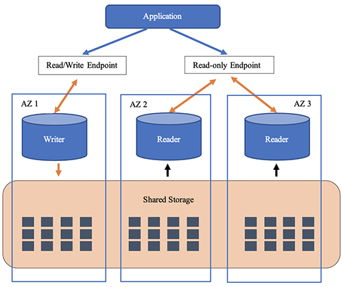
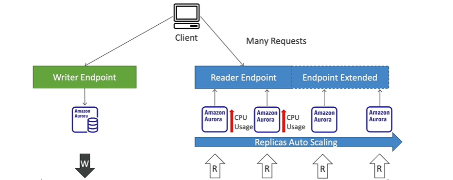

****
**Amazon Aurora**

* Aurora is a proprietary technology from AWS (Not open sourced)
* Postgres and MySQL are both supported as Aurora DB (that means your drivers will work as if Aurora was a Postgres or MySQL database)
* Aurora is "AWS Cloud Optimized" and claims 5x performance imporvment over MySQL on RDS, over 3x the performance of Postgres on RDS
* Aurora storage automatically grows in increments of 10GB up to 128 TB
* Aurora can have up to 15 replicas and the replication process is faster than MySQL (sub 10 ms replica lag)
* Failover in Aurora is instantaneous. It's HA native

**High Avaliability and Read Scaling**

* 6 copies of your data across 3 AZ:
  * 4 copies out of 6 needed for writes
  * 3 copies out of 6 need for reads
  * Self healing with peer-to-peer replication
  * Storage is striped across 100s of volumes
* One Aurora Instance takes writes (master)
* Automated failover for master in less than 30 seconds
* Master + up to 15 Aurora Read Replicas serve reads
* Support for Cross Region Replication

**Aurora Cluster illustration**

**Features of Aurora**

* Automatic fail-ver
* Backup and Recovery
* Isolation and security
* Industry compliance
* Push-button scaling
* Automated Patching with Zero Downtime
* Advanced Monitoring
* Routine Maintenance
* Backtrack: Restore data at any point of time without using backups
****

**Aurora Replicas - Auto Scaling**

**Custom Endpoints**

* Define a subset of Aurora Instances as a Custom Endpoint
* Example: Run analytical queries on specific replicas
* The Reader Endpoint is generally not used after defining Custom Endpoints

**Aurora Serverless**

* Automated database instantiation and auto-scaling based on actual usage
* Good for infrequent, intermittent or unpredictable workloads
* No capacity planning needed
* Pay per second, can be more cost-effective

**Aurora Multi Master**

* In case you want **continuous write avaliability** for the writer nodes
* Every node does R/W - vs promotiong a Read Replica as the new master

**Global Aurora**

* **Aurora Cross Region Read Replicas**
  * Useful for disaster recovery
  * Simple to put in place
* **Aurora Global Database (recommended)**
  * 1 Primary Region (read/write)
  * Up to 5 secondary (read only) regions, application lag is less than 1 second
  * Up to 16 Read Replicas per secondary region
  * Helps for decreasing latency
  * Promoting another region (for disaster recovery) has an RTO of < 1 minute
  * **Typical cross-region replication takes less than 1 second**

**Aurora Machine Learning**

* Enables you to add ML-based predictions to your applications via SQL
* Simple, optimized, and secure integration between Aurora and AWS ML services
* Supported Services:
  * Amazon SageMaker (use with any ML model)
  * Amazon Comprehend (for sentiment analysis)
* You don't need to have ML experience
* Use Cases:
  * Fraud detection
  * Ads Targeting
  * Sentiment Analysis
  * Product Recommendations
  ****

**Backups**

  * **Automated Backups**
    * 1 to 35 days (cannot be disabled)
    * Point in time recovery in that timeframe
  * **Manual DB Snapshots**
    * Manually triggered by the user
    * Retention of backup for as long as you want
  
**Restore Options**

* **Restoing an RDS/AURORA backup or a snapshot** creates a new database

* **Restoring MySQL Aurora cluster from S3**
  * Create a backup of your on premise database using Percona XtraBackup
  * Store the backup file on Amazon S3
  * Restore the backup file onto a new Aurora cluster running MySQL

**Database Cloning**

* Create a new Aurora DB Cluster from an existing one 
* Faster than Snapshot and restore
* Uses **Copy-On-Write** protocol
  * Initially, the new DB Cluster uses the same data volume as the original DB cluster (fast and efficient, no copy is needed)
  * When updates are made to the new DB Cluster data, then additional storage is allocated and data is copied to be separated
* Very fast and cost effective
* **Useful to create a Staging database from a production database without impacting the production database**