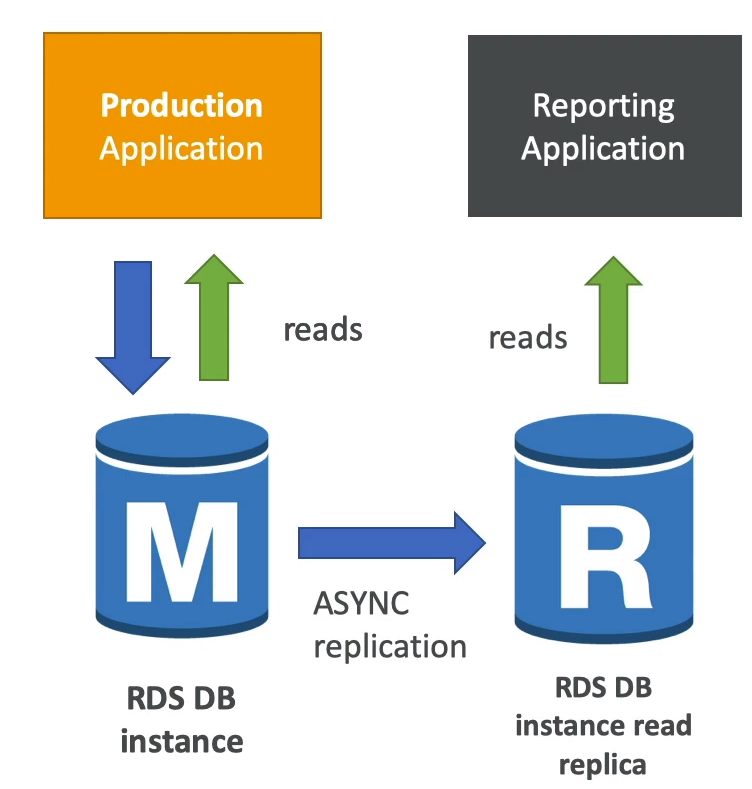

****
**RDS Overview**

* RDS stands for Relational Database Service
* It's a managed DB service for DB use SQL as query language
* It allows you to create databases in the cloud that are managed by AWS
    * Postgres
    * MySQL
    * MariaDB
    * Oracle
    * Microsoft SQL Server
    * Aurora (AWS Propietary)

**Advantages over using RDS versus deploying DB on EC2**

* RDS is a managed service
  * Automated provisioning
  * OS Patching
  * Continuous backups and restore to specific timestamp (Point In Time Restore)
  * Monitoring dashboards
  * Read replicas for improved read performance
  * Multi-AZ setup for DR (Disaster Recovery)
  * Maintance windows for upgrades
  * Scaling capability (Vertical/Horizontal)
  * Storage backed by EBS (gp2 or io1)
* You can't SSH into your instances
    
**Storage Auto Scaling**

* Helps you increase storage on your RDS DB instance dynamically
* When RDS detects you are running out of free database storage, it scales automatically
* Avoid manually scaling your database storage
* You have to set **Maximum Storage Treshold** (Maximum limit for DB storage)
* Automatically modify storage if:
  * Free storage is less than 10% of allocated storage
  * Low storage lasts at least 5 minutes
  * 6 hours passes since last modification  
* Useful for applications with **unpredictable workloads**
* Supports all RDS database engines (MariaDB, MySQL, PostgreSQL, SQL Server, Oracle)
****

**RDS Read Replicas for read scalability**

* Up to 15 read replicas
* Within AZ, Cross AZ or Cross Region
* Replication is **ASYNC**, so reads are eventually consistent
* Replicas can be promoted to their own DB
* Applications must update the connection string to leverage read replicas

**Use Cases**

* You have a production database that is taking on normal load
* You want to run a reporting application to run some analytics
* You create a Read Replica to run the new worload there
* The production application is unaffected
* Read replicas are used for SELECT (read) only kind of statements, not CRUD operations

**Network Cost**

* In AWS there's a network cost when data goes from one AZ to another
* **For RDS Read Replicas withing the same region, you don't pay that fee**

**Mutli AZ Disaster Recovery**

* **Sync** Replication
* One DNS name - Automatic app failover to standby
* Increase **avaliability**
* Failover in case of loss of AZ, loss of network, instance or storage failure
* No manual intervention in apps
* Not used for scaling
* The read replicas must be setup as Multi AZ for Disaster Recovery (DR)

**From Single-AZ to Multi-AZ**

* Zero downtime operation (No need to stop the DB)
* Just click on modify for the database
* The following happens internally
  * A snashot is taken
  * A new DB is restored from the snapshot in a new AZ
  * Synchronization is established between the two databases
**** 

**RDS Custom**

* **Managed Oracke and Microsoft SQL Server Database with OS and database customization**
* RDS Automates setup, operation and scaling of databases in AWS
* Custom: access to the underlying database and OS sou you can:
  * Configure settings
  * Install Patches
  * Enable native features
  * Access the underlying EC2 instance using SSH or SSM Session Manager
* **De-activate Automation Mode** to perform your customization better to take a DB snapshot before
* RDS vs RDS Custom:
  * RDS: Entire database and the OS to be managed by AWS
  * RDS Custom: Full admin access to the underlying OS and the database
**** 

**RDS Backups**

* **Automated Backups**
  * Daily full backup of the database (during the backup window)
  * Transaction logs are backed-up by RDS every 5 minutes
  * Ability to restore to any point in time (From oldest backup to 5 minutes ago)
  * 1 to 35 days of retention, set 0 to disable automated backups
* **Manual DB Snapshots**
  * Manually triggered by the user
  * Retention of backup for as long as you want

* **Trick** 
  * In a stopped RDS database, you will still pay for storage. If you plan on stopping it for a long time, you should snapshot and restore instead 

**Restore Options**

* **Restoing an RDS/AURORA backup or a snapshot** creates a new database

* **Restoring MySQL RDS Database from S3**
  * Create a backup of your on-premises database
  * Store it on Amazon S3 (Object storage)
  * Restore the backup file onto a new RDS instance running MySQL