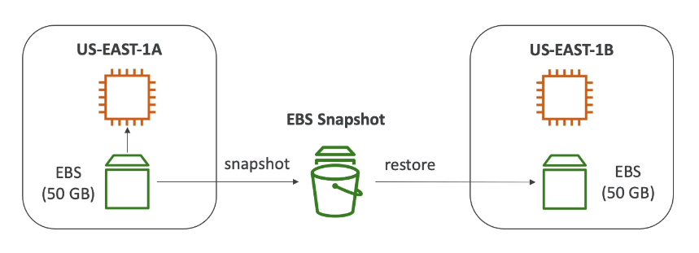

****
**What is an EBS Volume?**

* An **EBS (Elastic Block Store) Volume** is a **Network Drive** you can attach to your instances while they run
* It allows your instances to persist data, even after their termination
* **They can only be mounted to one instance at a time** (at the CCP level)
* They are bound to a **specific AZ**
* Analogy: Think of them as  a "network USB stick"
* Free tier: 30 GB of free EBS Storage of type General Purpose (SSD) or Magnetic per month
****

**EBS Volume**

* **It's a Network drive (i.e not a physical drive)**
    * It uses the network to communicate the instance, which means there might be a bit of latency
    * It can be detached from one EC2 instance to another quickly
* **It's locked to an AZ**
    * An EBS volume in us-east-1a cannot be attached to us-east-1b 
    * To move a volume accross first you need to snapshot it
* **Have a provisioned capacity (size in GBs and IOPS)**
    * You get billed for all the provisioned capacity
****

**EBS Delete on Termination attribute**

* Controls the EBS behavior when an EC2 instance is terminated
    * By default, the root EBS volume is deleted (attribute enabled)
    * By default, any other attached EBS Volume is not deleted (attribute disabled)
* This can be controlled by the AWS Console / AWS CLI
* **Use case: Preserve root volume when instance is terminated**
****

**EBS Snapshots**

* Make a backup (snapshot) of your EBS volume at a point in time
* Not necessary to detach the volume to do snapshot, but recommended
* Can copy snapshots across AZ or Region

****

**EBS Snapshots Features**

* **EBS Snapshot Archive**
    * Move the snapshot to an "Archive Tear" that is 75% cheaper
    * Takes within 24 to 72 hours to restore the archive
* **Recycle bin for EBS Snapshots**
    * Setup rules to retain deleted spanshots so you can recover then after an accidental deletion
    * Specify retention: From 1 day to 1 year
* **Fast snapshot Restore**
    * Force full initialization of snapshot to have no latency on first use (More expensive)
****

**EBS Volume Types**

* EBS Volumes come in 6 types
    * **gp2/gp3 (SSD):** General purpose SSD volume that balances price and performance for a wide variety of workloads
    * **io1/io2(SSD):** Highest-performance SSD volume for mission-critical low latency or high-throughput workloads
    * **st1 (HDD):** Low cost HDD volume designed for frequently accesses throughput-intensive workloads
    * **sc1 (HDD):** Lowest cost HDD volume designed for less frequently accessed worloads
* EBS Volumes are characterized in Size|Throughput|IOPS (I/O Ops Per Sec)
* When in doubt, always consult the AWS documentation
* **Only gp2/gp3 and io1/io2 can be used as boot volumes**
****

**EBS Volume Types Use Cases**

* **General Purpose SSD**
    * Cost effective storage, low-latency
    * System boot volumes, Virtual desktops, Development and test environments
    * 1GiB - 16TiB
    * gp3:
        * Baseline of 3000 IOPS and throughput of 125MiB/s
        * Can increase IOPS up to 16.000 and throughput up to 1000MiB/s independently
    * gp2:
        * Small gp2 volumes can burst IOPS to 3000
        * Size of the volume and IOPS are linked, max IOPS is 16000
        * 3 IOPS per GB means at 5334 GB we are at the max IOPS
* **Provisioned IOPS (PIOPS) SSD**
    * Critical business applications with sustained IOPS performance
    * Or applications that need more than 16000 IOPS
    * Great for **databases workloads** (sensitive to storage perf and consistency)
    * io1/io2(4 GiB - 16 TiB):
        * Max PIOPS: 64000 for Nitro EC2 instances & 32000 for other
        * Can increase PIOPS independently from sotrage size
        * io2 have more durability and more IOPS:GiB ratio of 1000:1
    * io2 Block Express(4 GiB - 64 TiB):
        * Sub-millisecond latency
        * Max PIOPS: 256000 with an IOPS:GiB ratio of 1000:1
* **Hard Disk Drives (HDD)**
    * Cannot be a boot volume
    * 125 GiB to 16 TiB
    * Throughput Optimized HDD (st1)
        * Big Data, Data Warehouses, Log Processing
        * **Max throughput** 500 MiB/s - max IOPS 500
    * Cold HDD (sc1):
        * For data that is infrequently accessed
        * Scenarios where lowest cost is important
        * **Max Throughput** 250 MiB/s - max IOPS 250
****

**EBS Multi-Attach - io1-io2 Family**

* Attach the same EBS Volume to multiple EC2 instances in the same AZ
* Each instance has full read & write permissions to the high-performance volume
* Use Case:
    * Achieve **higher application avaliability** in clustered Linux applications (ex: Teradata)
    * Applications must manage concurrent write operations
* **Up to 16 EC2 instances at a time**
* Must use a filesystem that is cluster aware (not XFS, EXT4, etc...)
****

**EBS Encryption**

* When you create an encrypted EBS Volume, you get the following:
    * Data at rest is encrypred inside the volume
    * All the data in flight moving between the instance and the volumes is encrypted
    * All snapshots are encrypted
    * All volumes created from the snapshot
* Encryption and Decryption are handled transparently (you have nothing to do)
* Encryption has a minimal impact on latency
* EBS Encryption leverage keys from KMS (AES-256)
* Copying an unencrypted snapshot allows encryption
* Snapshots of encrypted volumes are encrypted

**Encryption: Encrypt an unencrypted EBS Volume**

* Create an EBS snapshot of the volume
* Encrypt the EBS Snapshot (using copy) 
* Create new EBS Volume from the snapshot (the volume will also be encrypted)
* Now you can attach the encrypted volume to the original instance
****