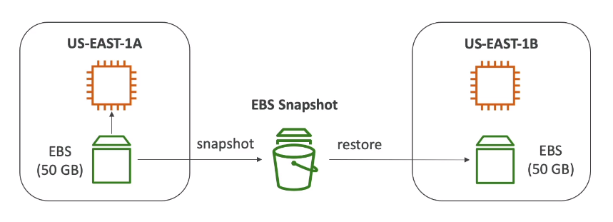

****

**EBS Snapshots**

* Make a backup (snapshot) of your EBS volume at a point in time
* Not necessary to detach the volume to do snapshot, but recommended
* Can copy snapshots across AZ or Region

****

**EBS Snapshots Features**

* **EBS Snapshot Archive**
    * Move the snapshot to an "Archive Tear" that is 75% cheaper
    * Takes within 24 to 72 hours to restore the archive
* **Recycle bin for EBS Snapshots**
    * Setup rules to retain deleted spanshots so you can recover then after an accidental deletion
    * Specify retention: From 1 day to 1 year
* **Fast snapshot Restore**
    * Force full initialization of snapshot to have no latency on first use (More expensive)

