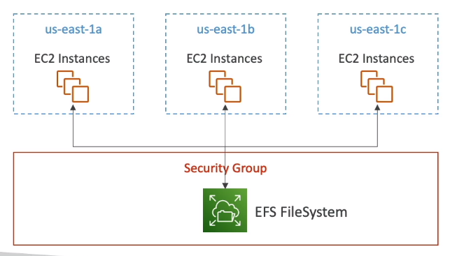

****
**Amazon EFS (Elastic File System)**

* Managed NFS (network file system) that can be mounted on many EC2
* EFS works with EC2 instances in multi-AZ
* Highly avaliable, scalable, expensive (3x gp2), pay per use

* Use cases:
    * Content management
    * Web Serving
    * Data Sharing
    * Wordpress
* Uses NFSv4.1 protocol
* Uses security group to control access to EFS
* **Compatible with Linux based AMI, not Windows**
* Encryption at rest using KMS
* POSIX file system (~Linux) that has a standar file api
* File system scales automatically, pay-per-use, no capacity planning
****

**EFS - Performance and Storage Classes**

* **EFS Scale**
    * 1000s of concurrent NFS clients, 10 GB + /s throughput
    * Grow to Petabyte-scale network file system, automatically
* **Performance Mode (Set at EFS creation time)**
    * **General Purpose (default):** Latency sensitive use cases (web server, CMS, etc...)
    * **Max I/O:** higher latency, throughput, highly parallel (big data, media processing)
* **Throughput Mode**
    * **Bursting:** 1TB = 50MiB/s + burst up to 100MiB/s
    * **Provisioned:** Set your throughput regardless of storage size, ex: 1GiB/s for 1TB storage
    * **Elastic:** Automatic scales throughput up or down based on your workloads
        * Up to 3GiB/s for reads and 1GiB/s for writes
        * Used for unpredictable workloads
****

**EFS Storage Classes**

* **Storage Tiers(lifecycle management feature - move file after N days)**
    * Standard for frequently accessed files
    * Infrequent access (EFS-IA): Cost to retrieve files, lower price to store. Enable EFS-IA with a lifecycle police
* **Avaliability and Durability**
    * Standard: Multi-AZ, great for prod
    * One Zone: One AZ, great for dev, backup enabled by default, compatible with IA (EFS One Zone-IA)
    * Over 90% in cost savings
****

**EBS vs EFS**

* **EBS Volumes:**
    * One instance (except multi-attach io1/io2)
    * Are locked at the AZ level
    * gp2: IO Increases if the disk size increases
    * io1: Can increase IO independently
    * To migrate a EBS Volume accross AZ:
        * Take a spanshot
        * Restore the snapshot to another AZ
        * EBS Backups use IO and you shouldn't run them when your application is handling a lot of traffic
    * Root EBS Volumes of instances get terminated by default if the EC2 instance gets terminated (can be disabled)
* **EFS:**
    * Mounting 100s of instances accross AZ
    * EFS share website files (WordPress)
    * Only for linux instances (POSIX)
    * EFS has a higher price point than EBS
    * Can leverage EFS-IA for cost savings
    * Remember: EFS vs EBS vs Instance Store