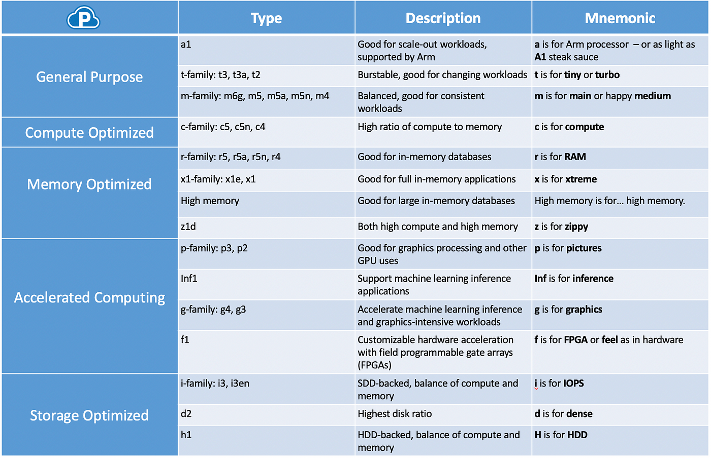

****
**Amazon EC2**

* EC2 is one of the most popular of AWS' offering.
* EC2 = Elastic Compute Cloud = Infrastructure as a Service
* It mainly consists in the capability of:
    * Renting virtual machines **(EC2)**
    * Storing data on virtual drives **(EBS)**
    * Distributing load across machinex **(ELB)**
    * Scaling the services using an auto-scalling group **(ASG)**
* Knowing EC2 is fundamental to undersant how the Cloud works
****

**EC2 Sizing & Configuration options**

* Operating System (OS): Linux, Windows or Mac OS
* How much compute power & cores **(CPU)**
* How much random-access memory **(RAM)**
* How much storage space: 
    * Network attached **(EBS & EFS)**
    * Hardware **(EC2 Instance Store)**
* Network card: Speed of the card, Public IP address
* Firewall rules: **Security Group**
* Bootstrap script (configure at first launch): EC2 User Data
****

**EC2 User Data**

* It is possible to bootstrap our instances using an EC2 User data script.
* Bootstraping means launching commands when a machine starts
* That script is only **run once** at the instance **first start**
* EC2 User data is used to automate boot tasks such as:
    * Installing Updates
    * Installing softwares
    * Downloading common files from the internet
    * Anything you can think of
* The EC2 User Data Script runs with the root user
****

**EC2 Instance Types**

*source: https://miro.medium.com/v2/resize:fit:1400/0*P9ayxQaaxeBdzcfW.png*
****

* You can use different types of EC2 instances that are optimised for different use cases (https://aws.amazon.com/ec2/instance-types/)
* AWS has the following nameing convention: **m5.2xlarge**
    * **m:** instance class
    * **5:** generation (AWS improves them over time)
    * **2xlarge:** size within the instance class
    ****