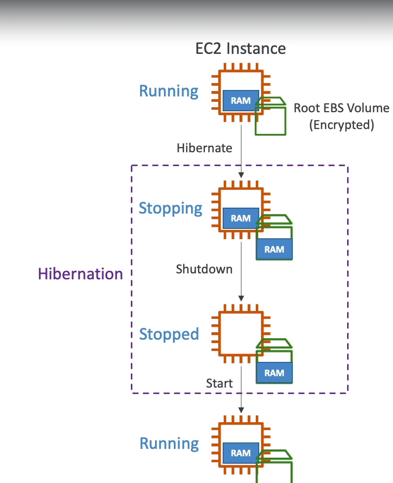

****
**EC2 Hibernate**

* Introducing **EC2 Hibernate:**
    * The in-memory(RAM) state is preserved
    * The instance boot is much faster (The OS is not stopped/restarted)
    * Under the hood: The RAM state is written to a file in the root EBS volume
    * The root EBS volume must be encrypted
****

* **Use Cases:**
    * Long-running proccessing
    * Saving the RAM state
    * Services that take time to initialize
****

* **Example**

****

* **Good to know Topics:**

* **Supported Instance Families:** C3,C4,C5,I3,M3,M4,R3,R4,T2,T3...
* **Instance RAM Size:** Must be less than 150 GB
* **Instance Size:** Not supported for Bare Metal instances
* **AMI:** Amazon Linux 2, Linux AMI, Ubuntu, RHEL, CentOS, Windows...
* **Root Volume:** Must be EBS, encrypted, not instance store and large
* Avaliable for **On-Demand, Reserved and Spot** instances
* An instance cannot be hibernated for more than **60 days**