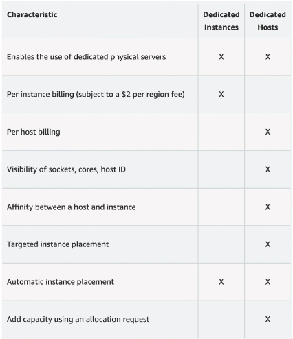
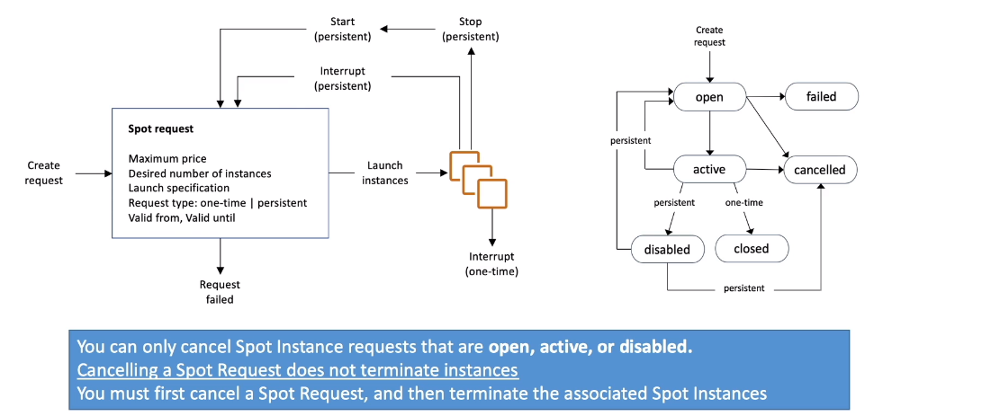

****
**EC2 Instances Purchasing Options**

* **On-Demand Instances:** Short workload, predictable pricing, pay by second
* **Reserved (1 & 3 years):**
    * **Reserved Instances:** Log workloads
    * **Convertible Reserved Instances:** Long workloads with flexible instances
* **Saving Plans (1 & 3 years):** Commitment to an amount of usage, long workload
* **Spot Instances:** Short workloads, chean, can lose instances (less reliable)
* **Dedicated Hosts:** Book an entire physical server, control instance placement
* **Dedicated Instances:** No other customer will share your hardware
* **Capacity Reservations:** Reserve capacity in a specific AZ for any duration
****

**EC2 On Demand**

* Pay for what you use
    * Linux or Windows - billing per second, after the first minute
    * All other Operational Systems: billing per hour
* Has the highest cost, but no upfront payment
* No long term commitment
* Recommended for **short term** and **un-interrupted workloads**, where you can't predict how the application will believe 
****

**EC2 Reserved Instances**

* Up to **72%** discount compared to On-Demand
* You reserve soecific instance attributes **(Instance Type, Region, Tenancy, OS)**
* Reservation period - 1 year + discount or 3 years with even more discount
* Payment options: **No Upfrount, Partial Upfrount, All Upofrount**
* Reserved instance's scope: **Regional or Zonal** (Reserve capacity in AZ)
* Recommended for steady-state applications, like databases
* You can buy and sell in the Reserved Instance Marketplace
* **Convertible Reserved Instance**
    * Can change the EC2 instance type, instance family, OS, scope and tenancy
    * Up to 66% discount
****

**EC2 Saving Plans**

* Get a dsicount based on long-term usage (up to 72% - same as RIs)
* Commit to a certain type of usage ($10/hour for 1 to 3 years)
* Usage beyond EC2 Saving Plans is billed at the On-Demand price
* Locked to a specific instance family and AWS Region (e.g, M5 in us-east-1)
* Flexible across:
    * Instance Size (e.g., m5.2xlarge)
    * OS (e.g., Linux, Windows)
    * Tenancy (Host, Dedicated, Default)
****

**EC2 Spot Instances**

* **Can get a discount up to 90%** compared to On-Demand
* Instances that you can "lose" at any point of time if your max price is less than the current spot price
* The **Most cost-efficient** instances in AWS
* **Usefull for workloads resilient to failure**
    * Batch Jobs
    * Data analysis
    * Image processing 
    * Any **Distributed workloads**
    * Workloads with a flexible start and end time
* **Not suitable for critical jobs or databases**
****

**EC2 Dedicated Hosts**

* A physical server with EC2 instance capacity fully dedicated to your use
* Allows you address **compliance requirements** and **use your existing server-bound software licenses** (per socket, per core, pe-VM Software licenses)
* Purchasing Options:
    * **On-Demand:** Pay per second for active Dedicated Host
    * **Reserved:** 1 or 3 years (No Upfront, Partial Upfront, All Upfront)
* The most expensive option
* Useful for sfotwares that have complicated license model (BYOL - Bring your own license)
* Or for companies that have strong regulatory or compliance needs
****

**EC2 Dedicated Instances**

* Instance Runs on hardware dedicated to you
* May share hardware with other instances in the same account
* No control over instance placement (Can move hardware after stop/start)
****

**Dedicated Instances x Dedicated Hosts**

****

**EC2 Capacity Reservations**

* Reserve **On-Demand** instances capacity in a specific AZ for any duration
* You always have access to EC2 Capacity when you need it
* **No time commitment** (create/cancel any time), **no billing discounts**
* Combine with Regional Reserved Instances and Saving Plans to benefit from billing discounts
* You are charged at On-Demand rate whether you run instances or not
* Suitable for short term, uninterrupted  workloads that need to be in a specific AZ
****

**Which purchasing option is right for me?**

* **On-Demand:** Coming and staying in resort whenever we like, we pay the full price
* **Reserved:** Like planning ahead and if we plan to stay for a long time, we may get a good discount
* **Saving Plans:** Pay a certain amount per hour for a certain period and stay in any room type
* **Spot Instance:** The hotel allows people to bid for the empty rooms and the highest bidder keeps the rooms. You can get kicked out any time
* **Dedicated Hosts:** We book an entire building of the resort
* **Capacity Reservations:** You book a room for a period with full price even if you don't stay in it
****

**EC2 Spot Instances Requests**

* Can get a discount of up to 90% compared to On-Demand
* Define **max spot price** and get the instance while **current spot price < max**
    * The hourly spot price varies based on offer and capacity
    * If the current spot price > your max price you can choose to stop or terminate your instance with a 2 minutes grace period
* Other strategy, **Spot Block**
    * "block" spot instance during a specified time frame (1 to 6 hours) without interruptions
    * In rare situations the instance may be reclaimed
* **Used for batch jobs, data analysis, or workloads that are resilient to failure**
****

**How to Terminate Spot instances**

****

**Spot Fleets**

* Spot Fleets = Set of Spot Instances + (optional) On-Demand Instances
* The Spot Fleet will try to meet the target capacity with price constraints:
    * Define possible launch pools: Instance type (m5.large), OS, AZ
    * Can have multiple launch pools, so that the fleet can choose
    * Spot Fleet stop launching instances when reaching capacity or max cost
* Strategy to allocate Spot Instances:
    * **Lowest Price:** From the pool with the lowest price (cost-optimization, short workload)
    * **Diversified:** Distributed across all pools (Great for avaliability, long workloads)
    * **CapacityOptimized:** Pool with the optimal capacity for the number of instances
    * **PriceCapacityOptimized (recommended):** Pools with the highest capacity avaliable, then select the pool with the lowest price (best choice for most workloads)
* **Spot Fleets allows to automatically request Spot Instances with the lowest price**
****
