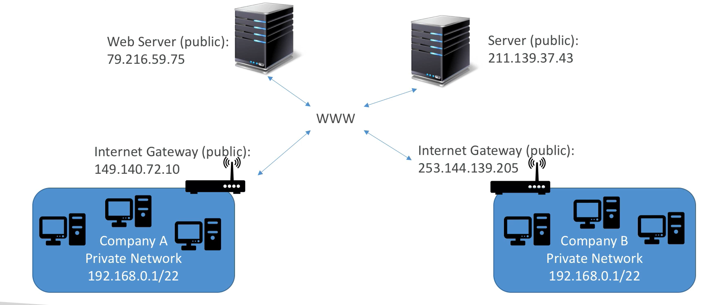

****
**Private vs Public IP (IPV4)**

* Networking has two sorts of IPs: IPV4 & IPV6
    * IPV4: 1.160.10.240
    * IPV6: 3ffe:1900:4545:3:200:f8ff:f321:67cf
* IPV4 is still the most common format used online
* IPV6 is newer and solves problems for the internet of Things (IoT)
* IPV4 allows for 3.7 billion different addresses in the public space
* IPV4: [0-255].[0-255].[0-255].[0-255]

**Private vs Public IP (IPV4) example**

**Fundamental Differences**

* **Public IP**
    * Public IP means the machine can be identified on the internet (WWW)
    * Must be unique across the whole web (not two machines can have the same public IP)
    * Can be geo-located easily
* **Private IP**
    * Private IP means the machine can only be identified on a private network only
    * The IP must be unique across the private network
    * BUT two different private networks (two companies) can have the same IPs
    * Machines connect to WWW using an internet gateway (a proxy)
    * Only a specified range of IPs can be used as private IP
****

**Elastic IPs**

* When you stop and then start an EC2 instance, it can change its public IP
* If you need to have a fixed public IP for your instance, you need an Elastic IP
* An Elastic IP is a public IPv4 IP you own as long as you don't delete it
* With an Elastic IP address, you can mask the failure of an instance or software by rapidly remapping the address to another instance in your account
* You can only have 5 Elastic IP in your account (you can ask AWS to increse that).
* Overall, **try to avoid using Elastic IP:**
    * They often reflect poor architectural decisions
    * Instead, use a random publiuc IP and register a DNS name to it
    * Or, use a Load Balancer and don't use a public IP
****

**Private vs Public Ip (IPV4) in AWS EC2**

* By default, your EC2 machine comes with:
    * A private IP for the internal AWS Network
    * A public IP, for the WWW
* When we are doing SSH into our EC2 machines:
    * We can't use a private IP, becase we are not in the same network
    * We can only use the public IP
* If your machine is stopped and then started, **the public ip can change**
****
