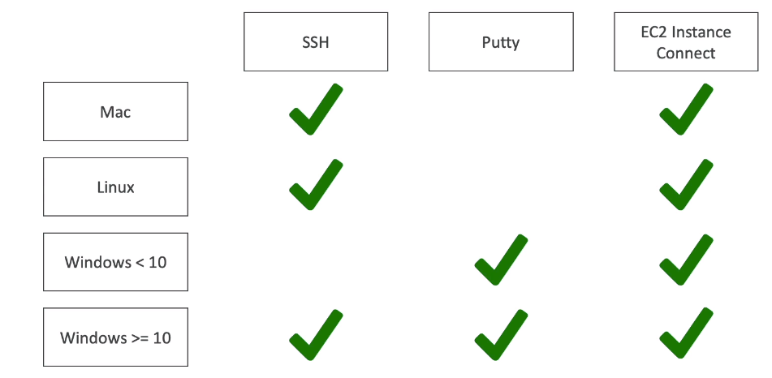

****
**What are Security Groups?**

* Security groups are the fundamentals of network security in AWS
* They control how traffic is allowed into or out of our EC2 instances
* Security Groups only contain **allow** rules
* Security Groups rules can reference by IP or by Security Group
* Security Groups acts as a firewall on EC2 instances
* They regulate:
    * Access to Ports
    * Authorized IP ranges - IPV4 and IPV6
    * Control of Inbound Network (From other to instance)
    * Contro of Outbound Network (From instance to other)
****

**Security Group Diagram Example**

*Source: https://dzone.com/articles/aws-security-groups-basics*
****

**Important Topics**

* Can be attached to multiple instances
* Locked down to a region/VPC combination
* Does live outside the EC2 - If the traffic is blocked, the EC2 instance won't see it
* **It's good to maintain a separate security group for SSH access**
* If your application is not accessible(time out), then it's a security group issue.
* If your application gives a connection refused error, the it's an application error or it's not launched
* All inbound traffic is **blocked** by default
* All outbound traffic is **allowed** by default
****

**Classic Ports to know**

* 22 = SSH (Secure Shell)- Log into a Linux instance
* 21 = FTP (File Transfer Protocol) - Upload files into a file share
* 22 = SFTP (Secure File Transfer Protocol) - Upload files using SSH
* 80 = HTTP - Access unsecured websites
* 443 = HTTPS - Access secured websites
* 3389 = RDP (Remote Desktop Protocol) - Log into a Windows instance 
****

**SSH Summary Table**

****
