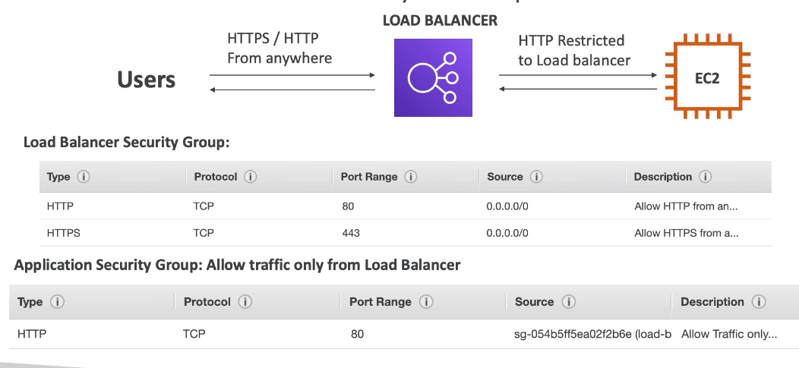

****
**What is a Load Balancer?**

* Load Balancers are servers that forward traffic to multiple servers downstream

**Why use a Load Balancer?**

* Spread across multiple downstream instances
* Expose a single point of access (DNS) to your application
* Seamlessly handle failures of downstream instances 
* Do regular health checks to your instances
* Provides SSL termination (HTTPS) for your websites
* Enforce stickiness with cookies
* High Avaliability accross zones
* Separates public traffic from private traffic

**Why use an Elastic Load Balancer?**

* An Elastic Load Balancer is a **managed load balancer**
    * AWS guarantees that will be working 
    * AWS takes care of upgrades, maintance, high avaliability
    * AWS provides only a few configuration knobs

* It costs less to setup your own Load Balancerm but it will be a lot more of effort from your part
* Its integrated with many AWS Offering/Services
    * EC2, EC2 Auto Scaling Groups, Amazon ECS
    * AWS Certificate Manager (ACM), Cloud Watch
    * Route 53, AWS WAF, AWS Global Accelerator

**Health Checks**

* Health checks are crucial for Load Balancers
* They enable the load balancer to know if instances it forwards traffics to are avaliable to reply requests
* The healtcheck is done on a port and a route (/health is common)
****

**Types of Load Balancer on AWS**

* AWS has **4 kinds of managed Load Balancers:**
    * **Classic Load Balancer(v1-old generation):** 2009 - CLB
        * HTTP, HTTPS, TCP, SSL (Secure TCP)
    * **Application Load Balancer(v2-new generation):** 2016 - ALB
        * HTTP, HTTPS, WebSocket
    * **Network Load Balancer(v2-new generation):** 2017 - NLB
        * TCP, TLS (Secure TCP), UDP
    * **Gateway Load Balancer:** 2020 - GWLB
        * Operates at layer 3 (Network Layer) - IP Protcol

* Overall, it is recommended to use the newer generation load balancer as they provide more features
* Some load balancer can be setup as **internal**(private) or **external**(public) ELBs

**Load Balancer Security Groups**
