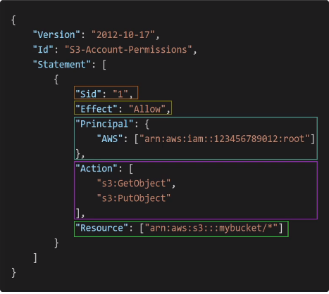

**IAM Users and Groups**

* **IAM**: Identity and access management, Global Service.

* **Root Account**: Created by default, shouldn't be used or shared.

* **Users**: Are people withing the organization, and can be grouped.

* **Groups**: Only contains users, not other groups. Users don't have to belong to a group, and user can belong to multiple groups.

**IAM Permissions**

* **Users or Groups**: Can be assigned JSON Document called *polices*. Theses polices define the **permissions** of the users. 

* **Least privilege principle**: In AWS, you apply the Least privilege principle. Don't give more permission than a user needs.

[See this example of a policy file with comments.](https://github.com/felipeNeves93/certified-solutions-architect-associate-study/blob/master/iam-aws%20cli/example-policy.json)

**IAM Policy Structure**

* Consists of:
    * **Version:** Policy language version, always include "2012-10-17".
    * **Id:** An identifier for the policy. (*Optional*)
    * **Statement:** One or more individual statements. (*Optional*)

* Statement consists of: 
    * **Sid:** An identifier for the statement. (*Optional*)
    * **Effect:** Wether the statement allows or denies access (*Allow, Deny*)
    * **Principal:** Account/user/role to which this policy applied to
    * **Action:** List of the actions the policy allow or denies.
    * **Resource:** List of resources to which the actions applied to.
    * **Condition:** Conditions for when the policy is in effect. (*Optional*) 

    **Example of a policy json file**

**IAM password Policy**

* Stronger passwords = Higher security for your account
* In AWS, you can setup a password policy:
    * Set a minimun password length
    * Require specific character types:
        * include uppercase letters
        * lowercase letters
        * numbers
        * non-alphanumeric characters
    * Allow all IAM users to change their own passwords
    * Require the user to change their password over a period of time
    * Prevent password re-use

**Multi Factor Authentication - MFA**

* Users have access yo your account and can possibly change configurations or delete resources in your AWS account.
* You want to protect your Root Accounts and IAM users
* MFA = password you know + security device you own
* Main benefit of MFA: if a password is stolen or hacked, the account is not compromised.

* **List of MFA device options:**
    * Virtual MFA device (Google Authenticator, Authy) (Multiple tokens on a single device)
    * Universal 2nd Factor (U2F) YubiKey, support for multiple root and IAM users using a single security key.
    * Hardware Key Fob MFA Device