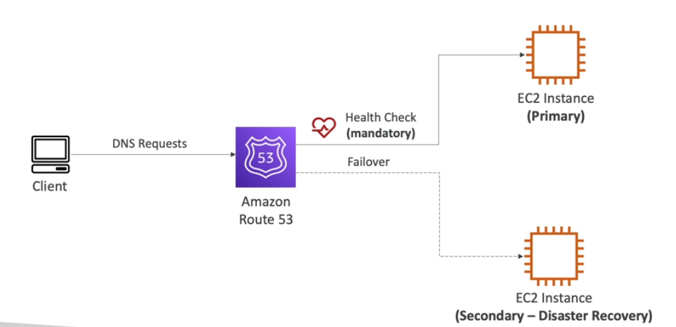

**Routing Policies Failover - Active-Passive**

**Routing Policies - Geolocation**

* Different from Latency-Based!
* **This routing is based on user location**
* Specify location by Continent, Country, or by US State (If there's overlapping, more precise location selected)
* Should create a **Default** record (in case there's no match on location)
* Use cases: website localization, restrict content distribution, load balancing
* Can be associated with health checks

**Routing Policies - Geoproximity**

* Route traffic to your resources based on the geographic location of uses and resources
* Ability **to shift more traffic to the resources based** on the defined **bias**
* To change the size of the geographic region, specify **bias** values:
  * To expand (1-99) - more traffic to the resource
  * To shrink (-1, -99)- Less traffic to the resource
* Resources can be:
  * AWS Resources (Specify AWS Region)
  * Non-AWS Resources (Specify Latitude and Longitude)
* **You must use Route 53 Traffic Flow (advanced) to use this feature** 

**Routing Policies - Ip-Based Routing**

* **Routing is based on Client's IP addresses**
* **You provide a list of CIDRs for your clients** and the corresponding endpoints/locations (User ip-to-endpoint mappings)
* Use Cases: Optimize performance, reduce network costs...
* Example: Route end users from a particular ISP to a specific endpoint

**Routing Policies - Multi-Value**

* Use when routing traffic to multiple resources
* Route 53 returns multiple value/resources 
* Can be associated with Health Checks (Return only values for healthy resources)
* Up to 8 Healthy Records are returned for each Multi-Value query
* **Multi Value is not a subistitute for having an ELB**
