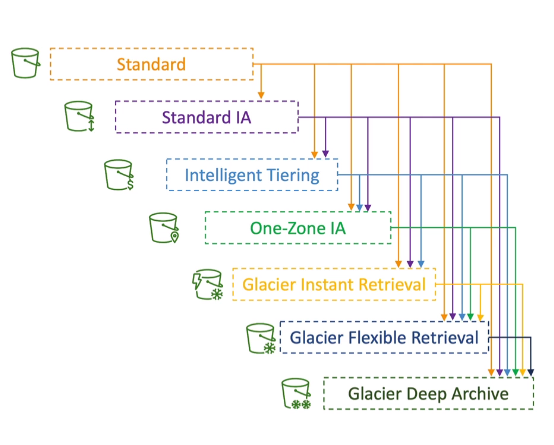

### Moving Between Storage Classes

* You can transition objects between storage classes
* For infrequently accessed object, move them to **Standard IA**
* For archive objects that you don't need fast access to, move them to **Glassier** or **Glassier Deep Archive**
* Moving objects can be automated using **Lifecycle Rules**

### Lifecycle Rules

* **Transition Actions**: Configure objects to transition to another storage class
  * Move objects to Standard IA class 60 days after creation
  * Move to Glassier for archiving after 6 months
  
* **Expiration Actions**: Configure objects to expire (delete) after some time
  * Access logs files can be set to delete after a 365 days 
  * **Can be used to delete old version of files (if versioning is enabled)**
  * Can be used to delete incomplete Multi Parti Uploads

* Rules can be created for a certain prefix: (example: s3://mybucket/mp3/*)
* Rules can be created for certain object tags: (Department: Finance)

### Lyfecicle Rules Scenario 1

* **Your application on EC2 creates images thumbnails after profile photos are uploaded to amazon s3. These thumbnails can be easily recreated, and only need to be kept for 60 days. The source images should be able to be immediately retrieved for these 60 days, and afterwards, the user can wait up to 6 hours. How would you design this?**

* **Solution**:
  * S3 Source images can be on **Standard**, with a lifecycle configuration to transition them to **Glacier** after 60 days
  * S3 thumbnails can be on **One-Zone-IA**, with a lifecycle configuration to expire them (delete them) after 60 days.

### Lyfecicle Rules Scenario 2

* **A rule in your company states that you should be able to recover your deleted S3 objects immediately for 30 days, although this may happen rarely. After this time, and for up to 365 days, deleted objects should be recoverable within 48 hours**
  
* **Solution:**
  * **Enable S3 Versioning** in order to have object versions, so that "deleted objects" are in fact hidden by a "delete marker" and can be recovered
  * Transition the "noncurrent versions" of the objects to the **Standard-IA**  
  * Transition afterwards the "noncurrent versions" to **Glacier Deep Archive** 

### Storage Class Analysis

* Helps you decide when to transition objects to the right storage class
* Reccomendations for **Standard** and **Standard IA** 
  * Does not work for One-Zone IA or Glacier
* Report is updated daily
* 24 to 48 hours to start seeing data analysis 
* Good first step to put together Lifecycle Rules or to improve them