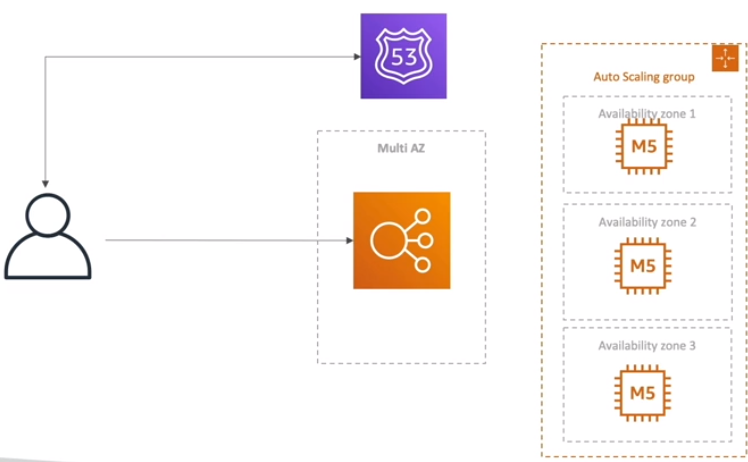

# The Problem

* MyClothes.com allows people to buy clothes online
* There's a shopping cart
* The website will have hundreds of users at the same time
* The website will need to scale, maintain horizontal scalability and keep the web application as stateless as possible
* Users should not loose their shopping cart
* Users should have their details stored on an database

## Approaches

### First Approach: Mutli AZ, ASG, private stateless EC2

* Won't work because every time the user do something, it will loose the cart
* Could be added the resource called Stickiness (Session Affinity, ELB resource)
* The problem is that if a instance is terminated for some reason, the shopping cart would still be lost

### Second Approach: Same resources as the first with the addition of User Cookies

* Will be Stateless
* Http Requests will be heavier
* Security rist because cookies can be altered
* Cookies must be validated
* Cookies must be less than 4KB

