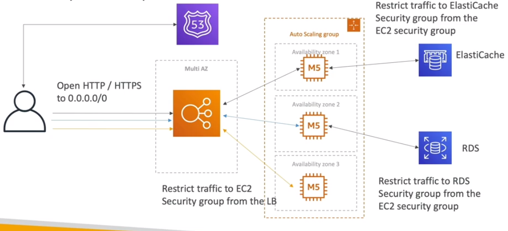

# The Problem

* MyClothes.com allows people to buy clothes online
* There's a shopping cart
* The website will have hundreds of users at the same time
* The website will need to scale, maintain horizontal scalability and keep the web application as stateless as possible
* Users should not loose their shopping cart
* Users should have their details stored on an database

## Approaches

### First Approach: Mutli AZ, ASG, private stateless EC2

* Won't work because every time the user do something, it will loose the cart
* Could be added the resource called Stickiness (Session Affinity, ELB resource)
* The problem is that if a instance is terminated for some reason, the shopping cart would still be lost

### Second Approach: Same resources as the first with the addition of User Cookies

* Will be Stateless
* Http Requests will be heavier
* Security rist because cookies can be altered
* Cookies must be validated
* Cookies must be less than 4KB

### Third Approach: Same resources as before, replacing cookies with Server Session and User Data on RDS

* Will pass through cookies only the session id
* The session will be stored at ElastiCache/DynamoDB
* The instances will retrieve the information with the session id
* Very quickly  
* User information can be retrieved querying the database
* To scale well and deal with high traffic, the strategy of using Master (writes) and Read replicas from RDS can be used

### Fourth Approach: Same as the step before, but using the technique of Lazy Loading

* When the instance requires the information (user), check the database and writes to the cache
  
### *Always use the Multi-AZ Feature in the resources to survive possible disasters*

### Security Groups:

### Topics discussed in this Architecture

* ELB Sticky Sessions
* Web Clients for storing cookies and making the web app stateless
* ElastiCache
  * For Storing Sessions(DynamoDB can also be utilized)
  * For caching data from RDS
  * Multi AZ    
* RDS
  * For storing user data
  * Read Replicas for scaling reads
  * Multi AZ for disaster recovery
* Tight Security with security groups referencing each other