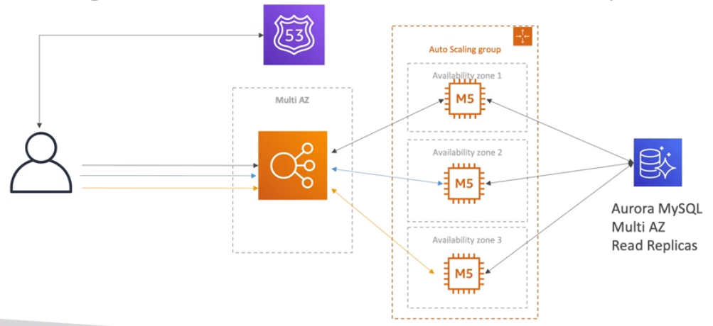
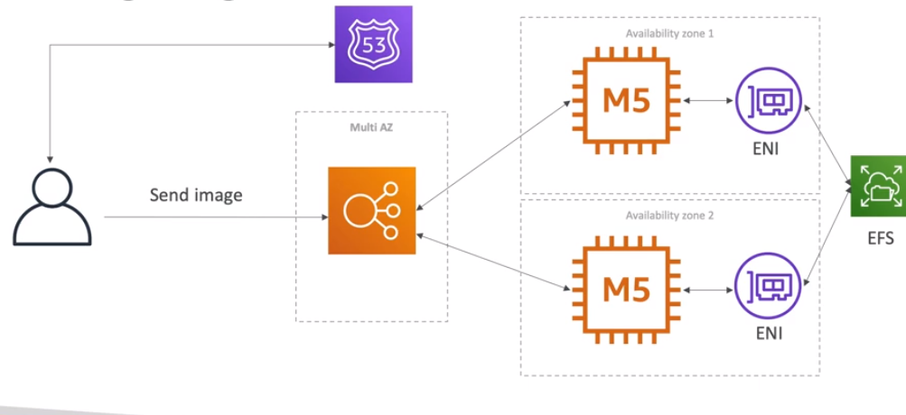

# The Problem

* The challenge is to create a fully scalable WordPress website
* The website needs to access and correctly display picture uploads
* The user data and the blog content should be stored on an MySQL database

### Solution 1: Aurora Multi-AZ with Read replicas

* Higher cost
* Highly scalable
* Disaster recovery

### Solution 2: Storing Images with EBS

* The User will hit the ELB, upload the image to the machine
* The image will be stored on the EBS volume of the machine
* The problem is when there are more instances (scaling), each machine will have its own EBS volume
* When user tries to recover the image, the requisition may hit a machine where the EBS doesn't contain the image

### Solution 3: Storing Images with EFS

* Thrugh ENI interfaces, all the instances can access the shared file system, and recover/write the images
* Its a common architecture utilized when the website storage needs to be accessed by multiple machines

### Topics discussed in this Architecture

* Aurora Database to have easy Multi-AZ and Read Replicas
* Storing data in EBS (Single instance application)
* Vs Storing data in EFS (Distributed application)